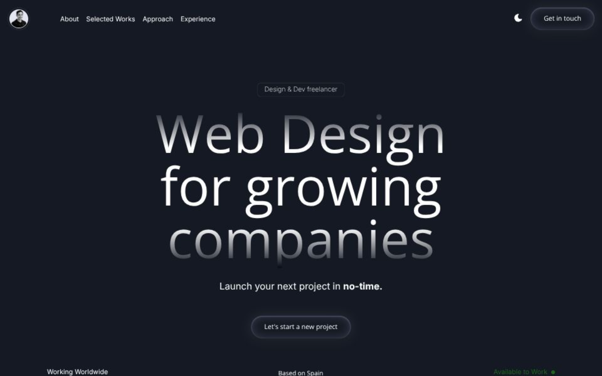

# Freelance Website



A modern freelance portfolio platform built with a high-performance Next.js frontend and a Strapi backend for content management.

Live site: [jordiparadelo.com](https://jordiparadelo.com)

This repository contains two applications:

- `frontend`: Next.js website
- `backend`: Strapi CMS API

## File Organization

```text
freelance-website/
├── frontend/   # Next.js app (UI, animations, pages)
├── backend/    # Strapi CMS (content types, API, admin)
└── README.md
```

## Prerequisites

- Node.js `>= 20`
- npm

## 1) Install dependencies

Run these commands from the project root:

```bash
cd backend && npm install
cd ../frontend && npm install
```

## 2) Configure environment variables

### Backend (`backend/.env`)

Copy the example file:

```bash
cd backend
cp .env.example .env
```

The default template is ready for local SQLite development.

### Frontend (`frontend/.env.local`)

Create `frontend/.env.local` with:

```bash
NEXT_PUBLIC_API_URL=http://localhost:1337
NEXT_PUBLIC_STRAPI_BASE_URL=http://localhost:1337

# Optional (only if you use Supabase features)
NEXT_PUBLIC_SUPABASE_URL=
NEXT_PUBLIC_SUPABASE_ANON_KEY=

# Optional site URL used in SEO config
URL=http://localhost:3000
```

## 3) Run in development

Use two terminals.

Terminal 1 (backend):

```bash
cd backend
npm run develop
```

Terminal 2 (frontend):

```bash
cd frontend
npm run dev
```

## Local URLs

- Frontend: [http://localhost:3000](http://localhost:3000)
- Backend API: [http://localhost:1337](http://localhost:1337)
- Strapi Admin: [http://localhost:1337/admin](http://localhost:1337/admin)

## Useful scripts

### Frontend

```bash
npm run dev
npm run build
npm run start
npm run lint
npm run format
```

### Backend

```bash
npm run develop
npm run build
npm run start
```
