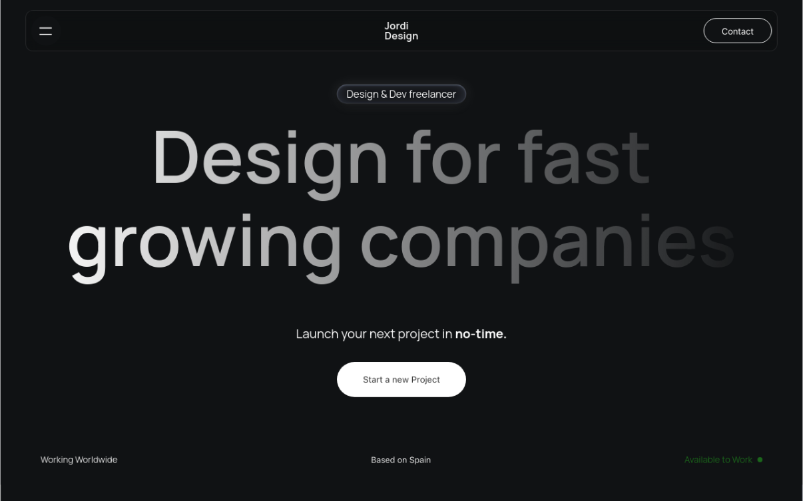

# Minimalist Dev Portfolio

Transforming Concepts into Seamless User Experiences

<div align="center">
  
</div>

## A Modern Next.js Portfolio

Build this project step by step with our detailed tutorial on [JavaScript Mastery](https://www.youtube.com/channel/JavaScriptMastery). Join the JSM family!

### Tech Stack
- 

## Table of Contents
1. [Introduction](#introduction)
2. [Tech Stack](#tech-stack)
3. [Features](#features)
4. [Quick Start](#quick-start)
5. [Code to Copy](#code-to-copy)
6. [Assets](#assets)
7. [More](#more)

## Introduction
Provide a brief introduction to your project, explaining what it is and what it aims to accomplish.

## Tech Stack
Describe the technologies used in the project.
- **Next.js**: A React framework for server-rendered applications.

## Features
List the main features of your project.
- Modern design
- Smooth animations
- Responsive layout
- SEO friendly

## Quick Start
Provide instructions on how to get the project up and running locally.
1. Clone the repository:
    ```bash
    git clone https://github.com/your-username/your-repo-name.git
    ```
2. Install dependencies:
    ```bash
    cd your-repo-name
    npm install
    ```
3. Run the development server:
    ```bash
    npm run dev
    ```
4. Open [http://localhost:3000](http://localhost:3000) in your browser to see the result.

## Assets
List any assets or resources used in the project.
- Images
- Fonts
- Icons
- Design

## More
Add any additional sections or links here.

---

Feel free to customize the template according to your project needs.